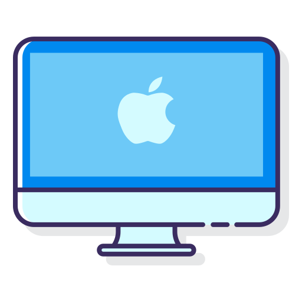

<header align="center">
    <div align="center">
        
    </div>
    <h1 align="center">Mac Dev Setup</h1>
    <p align="center">Simple setup with lot of goodies 🍎</p>
</header>

## Preferences

1. Enable **Trackpad** / **Tap to click**

2. Enable **Accessibility** / **Mouse and trackpad** / **Trackpad options** / **Enable dragging** / **Three finger drag**

3. Move dock to the left

4. Disable accent menu (needs restart):

```sh
defaults write -g ApplePressAndHoldEnabled -bool false
```

## Setup

1. Install [Firefox](https://www.mozilla.org/en-US/firefox/mac/).

2. Install [homebrew](https://brew.sh/). Also installs command line tools.

3. Install brew packages.

```sh
brew install git vim yarn wget watchman tree
```

4. Configure `git`:

```sh
git config --global user.name "First Last"
git config --global user.email email@email.com
```

5. Install [Fira Code](https://github.com/tonsky/FiraCode/wiki#installing-font), [flottflott](https://www.dafont.com/flottflott.font), [Space Mono](https://github.com/googlefonts/spacemono) and [Script12](https://www.dafontfree.net/freefonts-script12-bt-f141942.htm) fonts

6. Add [GPG](https://help.github.com/en/articles/managing-commit-signature-verification) and [SSH](https://help.github.com/en/articles/connecting-to-github-with-ssh) keys

7. Install `quick-look` plugins:

```sh
brew cask install qlcolorcode qlstephen qlmarkdown quicklook-json qlimagesize webpquicklook suspicious-package quicklookase qlvideo
```

### CLI

1. Install [Oh my ZSH](https://github.com/robbyrussell/oh-my-zsh)

2. Install [dotfiles](https://github.com/divyanshu013/dotfiles/)

#### CLI plugins

- [ZSH autosuggestions](https://github.com/zsh-users/zsh-autosuggestions/blob/master/INSTALL.md)
- [bgnotify](https://github.com/robbyrussell/oh-my-zsh/tree/master/plugins/bgnotify)
- [ZSH syntax highlighting](https://github.com/zsh-users/zsh-syntax-highlighting/blob/master/INSTALL.md)
- [z](https://github.com/robbyrussell/oh-my-zsh/tree/master/plugins/z)
- [fzf](https://github.com/junegunn/fzf)
- [fkill-cli](https://github.com/sindresorhus/fkill-cli)
- [fx](https://github.com/antonmedv/fx)
- [bat](https://github.com/sharkdp/bat#on-macos)
- [mps-youtube](https://github.com/mps-youtube/mps-youtube)
- [diff-so-fancy](https://github.com/so-fancy/diff-so-fancy)
- [screenfetch](https://github.com/KittyKatt/screenFetch)
- [pgcli](https://www.pgcli.com/)
- [mycli](https://www.mycli.net/)
- [ag](https://github.com/ggreer/the_silver_searcher)
- [cleanup](https://github.com/fwartner/mac-cleanup)
- [cliflix](https://github.com/fabiospampinato/cliflix)
- [sudo](https://github.com/robbyrussell/oh-my-zsh/tree/master/plugins/sudo)
- [web-search](https://github.com/robbyrussell/oh-my-zsh/tree/master/plugins/web-search)
- [jay](https://github.com/nikersify/jay)

### Browsers

- [Firefox](https://www.mozilla.org/en-US/firefox/mac/) - the best web browser
- [Chrome](https://www.google.com/chrome/) - because somethings work only on chrome

### Utils

- [Dato](https://sindresorhus.com/dato) - better date menu bar app
- [Bandwidth+](https://apps.apple.com/us/app/bandwidth/id490461369?mt=12) - bandwidth monitoring
- [Sensible side button](https://sensible-side-buttons.archagon.net/) - for gaming mouse
- [Scroll reverser](https://pilotmoon.com/scrollreverser/) - auto scroll reverse on mouse
- [Itsycal](https://www.mowglii.com/itsycal/) - view calendar from menu bar
- [KeepingYouAwake](https://github.com/newmarcel/KeepingYouAwake) - prevent mac from sleeping
- [Clipy](https://clipy-app.com/) - clipboard manager
- [Spectacle](https://www.spectacleapp.com/) - window manager
- [Kap](https://getkap.co/) - screen recorder
- [Mounty](https://mounty.app/) - NTFS volumes in write mode
- [Thor](https://apps.apple.com/cn/app/thor/id1120999687?l=en&mt=12) - painless application switching
- [Dozer](https://dozermac.com/) - hide menu bar icons
- [Android File Transfer](https://www.android.com/filetransfer/) - for android phones
- [Alfred](https://www.alfredapp.com/) - <kbd>Cmd</kbd> + <kbd>Space</kbd> everything
- [Pock](https://pock.dev/) - touchbar dock
- [Oversight](https://objective-see.com/products/oversight.html) - monitor for mic and webcam
- [Mute me](https://objective-see.com/products/oversight.html) - mute touchbar toggle

### Dev

- [Hyper](https://github.com/zeit/hyper) - minimal terminal
- [VSCode](https://code.visualstudio.com/download) - code editor
- [GPG Suite](https://gpgtools.org/) - gpg manager
- [Xcode](https://apps.apple.com/in/app/xcode/id497799835?mt=12) - react native stuff
- [Android Studio](https://developer.android.com/studio) - react native stuff
- [Insomnia](https://insomnia.rest/) - rest client
- [React Native Debugger](https://github.com/jhen0409/react-native-debugger/) - react native debugging
- [GraphQL Playground](https://github.com/prisma/graphql-playground) - graphql client
- [Table Plus](https://tableplus.io/) - the DB app
- [Sequel Pro](https://www.sequelpro.com/) - MySQL client
- [Postgres app](https://postgresapp.com/downloads.html) - Postgres for mac
- [Postico app](https://eggerapps.at/postico/) - Postgres client
- [MongoDB app](https://github.com/gcollazo/mongodbapp) - MongoDB for mac
- [Redis app](https://github.com/jpadilla/redisapp) - Redis for mac
- [Contraste](https://contrasteapp.com/) - simple color contrast ratio viewer
- [Medis](https://github.com/luin/medis) - redis client
- [Proxyman](https://proxyman.app/) - proxy client for apps
- [brew-services-menubar](https://github.com/andrewn/brew-services-menubar) - managing brew services from menubar

### Music

- [SpotMenu](https://github.com/kmikiy/SpotMenu) - spotify and itunes menubar app
- [Spotify](https://www.spotify.com/us/download/other/) - best music app (but not all music available yet)
- [LyricsX](https://github.com/ddddxxx/LyricsX) - song lyrics
- [YTMusic](https://ytmusic.app/) - YouTube music app
- [Studio One](https://my.presonus.com/products/software) - DAW
- [Audacity](https://www.audacityteam.org/download/mac/) - audio recorder
- [Boss Tone Studio](https://www.boss.info/global/products/gt-1/downloads/) - guitar processor software

### Apps

- [TunnelBear](https://www.tunnelbear.com/apps/mac) - VPN client
- [Zoom](https://zoom.us/download#client_4meeting) - video calls
- [Black Out](https://apps.apple.com/no/app/black-out/id1319884285) - hide sensitive information on images
- [Dropbox](https://www.dropbox.com/downloading) - cloud storage
- [Steam](https://store.steampowered.com/about/) - games
- [Notable](https://github.com/notable/notable/releases) - markdown editor
- [Discord](https://discordapp.com/api/download?platform=osx) - chat client
- [Figma](https://www.figma.com/downloads/) - design software
- [IINA](https://iina.io/) - media player
- [Pym](https://apps.apple.com/in/app/pym/id1451733095?mt=12&app=apps&ign-mpt=uo%3D4) - image compression
- [Davinci Resolve](https://www.blackmagicdesign.com/products/davinciresolve/) - video editing
- [Buttercup](https://buttercup.pw/) - password manager
- [App Cleaner](https://freemacsoft.net/appcleaner/) - app uninstaller
- [Authy](https://authy.com/download/) - 2FA client
- [Clocker](https://apps.apple.com/us/app/clocker-menubar-world-clock/id1056643111?mt=12) - timezones menubar app
- [Flip clock screensaver](https://fliqlo.com/#/screensaver) - nice screensaver

## Author

- [@divyanshu013](https://twitter.com/divyanshu013) 👋

### Attributions

<div>Icons made by <a href="https://www.flaticon.com/authors/flat-icons" title="Flat Icons">Flat Icons</a> from <a href="https://www.flaticon.com/" title="Flaticon">www.flaticon.com</a> is licensed by <a href="http://creativecommons.org/licenses/by/3.0/" title="Creative Commons BY 3.0" target="_blank">CC 3.0 BY</a></div>
